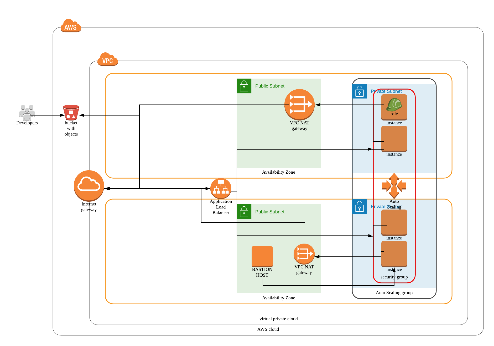
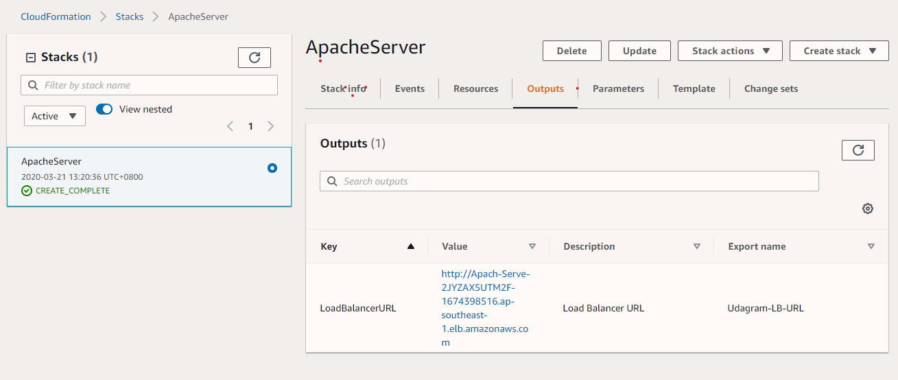

## [URL of LoadBalancer](http://apach-serve-2jyzax5utm2f-1674398516.ap-southeast-1.elb.amazonaws.com/)

- http://apach-serve-2jyzax5utm2f-1674398516.ap-southeast-1.elb.amazonaws.com/
- Instance Private IP has been embedded into Index.html

## Overview



## Resources

- S3 Bucket
- 1 VPC with
  - Internet Gateway
  - 2 NAT Gateway
- 1 Application Load Balancer
- 2 Availability Zones
- 1 Public and 1 Private Subnet in each AZ.
- 1 Bastion Host in Public Subnet 
- 2 Ubuntu Instances in each Private subnet .
  - With Autoscaling with CloudWatch alarm and Scale Up/Down Policies.
  - Minimum - 4 Instances
  - Maximum - 8 Instances
- 1  EC2 Role with S3 Access
- Security Groups
  - Bastion 
    - Inbound - 0.0.0.0/0 : 80
    - Outbound -  0.0.0.0/0 : 80 and 0.0.0.0/0:22 (to SSH into Server)
  - Load Balancer
    - Inbound - 0.0.0.0/0 : 80 
    - Outbound -  0.0.0.0/0 : 80
  - Server
    - Inbound - **Load Balancer Security Group** : 80 and **Bastion Security Group**(allow bastion access)
    - Outbound -  All IP and Ports 


### Requirements

- Create S3 Bucket with name  quan-udagram
  - Upload udacity.zip(contains index.html) into bucket 

- Bastion Host access is to only to AdminIP
  - To be hardcoded into ServerParams.json
- Create a UdacityS3ReadOnlyEC2 **IAM** role in your account
  - Permissions : EC2 Instance with S3 Read-only access
- Create **Bastion** and **Server Key Pair.**
  - Name for **Bastion** - BastionKey
  - Name for **Server Key Pair** - Private-server-devops-key\


#### Not implemented

- No requirements for SSM Parameter store as there is no credentials.
- S3 Gateway Endpoint for EC2 as there is NAT.

## Create Stack

```bash
./create.sh stackname final-project-starter.yml serverParams.json 
```

## Update Stack

```bash
./create.sh stackname final-project-starter.yml serverParams.json 
```

## Delete Stack

```bash
./delete.sh stackname
```

## Connecting to Bastion Host 

```bash
ssh -i Bastionkey ec2-user@bastionhostIP
```

## Connecting to Apache instance with Bastion 

1. Copy Private key  from your computer to Bastion host.

```bash
scp -i BastionKey.pem Private-server-devops-key.pem ec2-user@bastionhostIP
```

2.  Connect to Bastion host.

```bash
 ssh -i Bastionkey ec2-user@bastionhostIP
```

3.  Connect to instance.

```bash
ssh -i Private-server-devops-key.pem ubuntu@ApacheinstanceIP
```




